# InTechs 


프로젝트 관리 어플리케이션입니다.


**macOS**

|                      채팅                       |                    프로젝트 관리                     |
| :---------------------------------------------: | :--------------------------------------------------: |
| 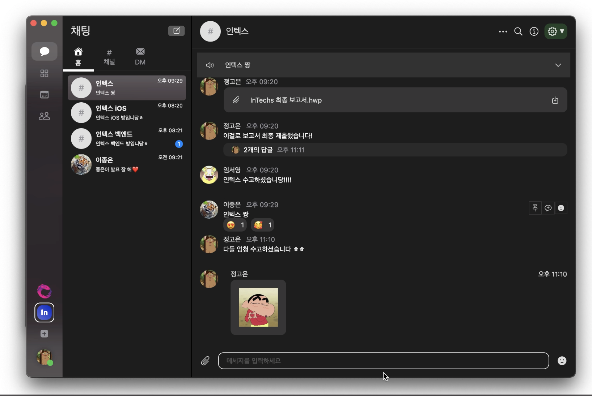 | 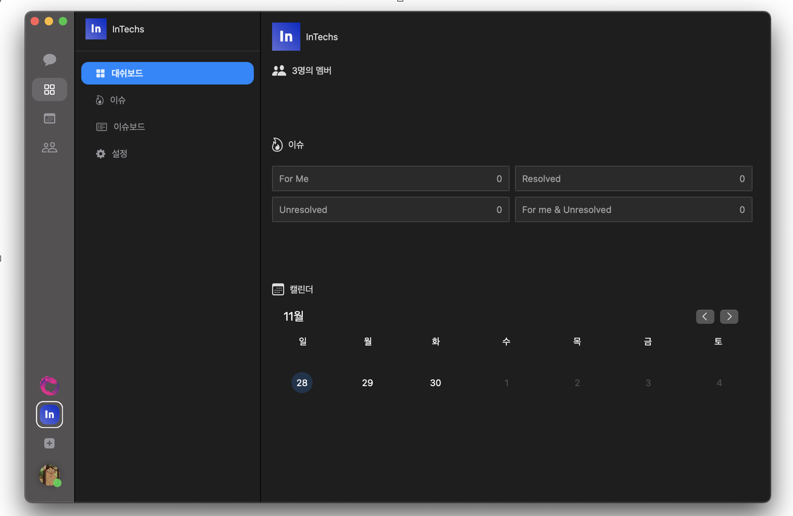 |

|                      이슈리스트                      |                       이슈보드                        |                       캘린더                        |
| :--------------------------------------------------: | :---------------------------------------------------: | :-------------------------------------------------: |
| 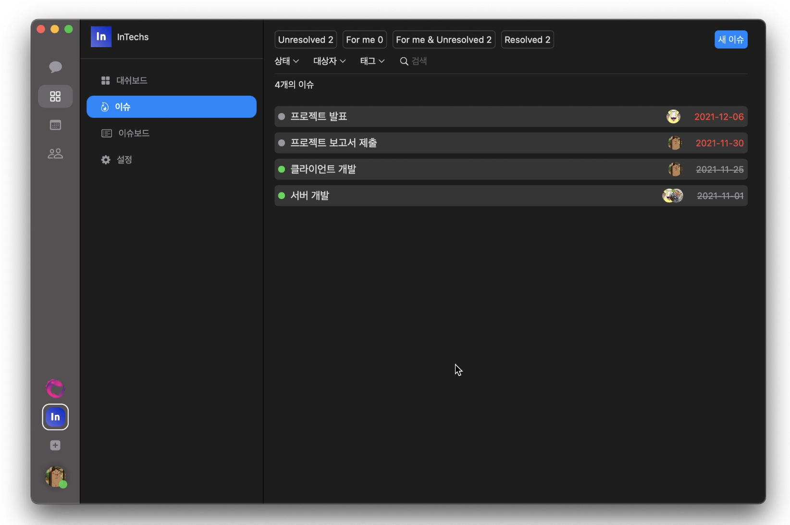 | 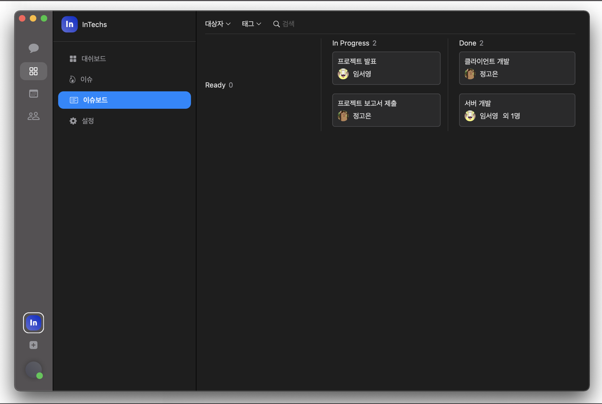 | 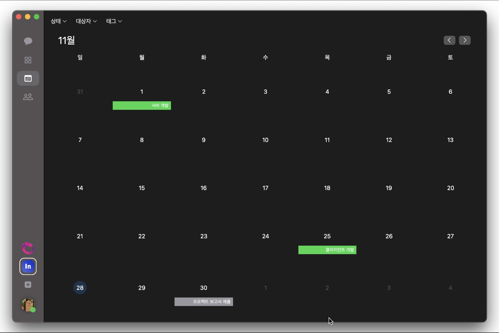 |


**iOS**

|                      채팅                       |                      이슈리스트                      |                       캘린더                        |                    마이페이지                     |
| :---------------------------------------------: | :--------------------------------------------------: | :-------------------------------------------------: | :-----------------------------------------------: |
| 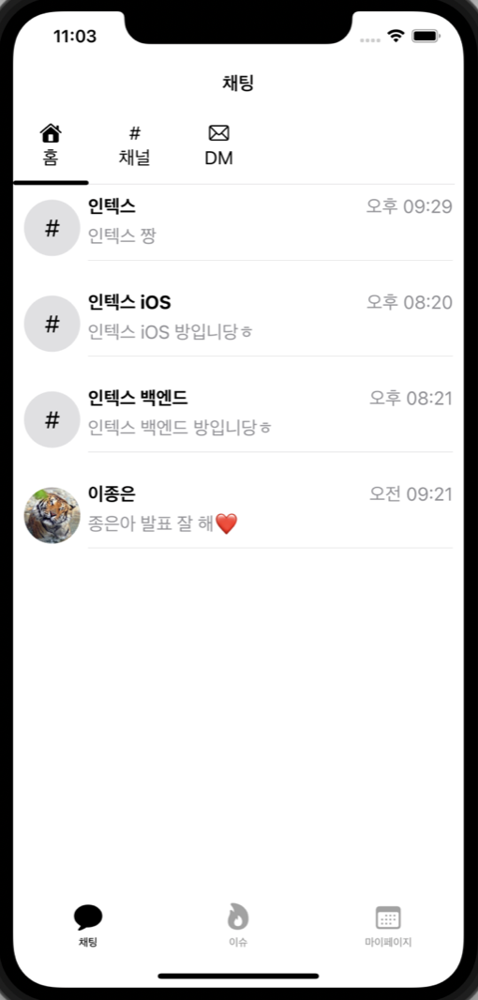 | 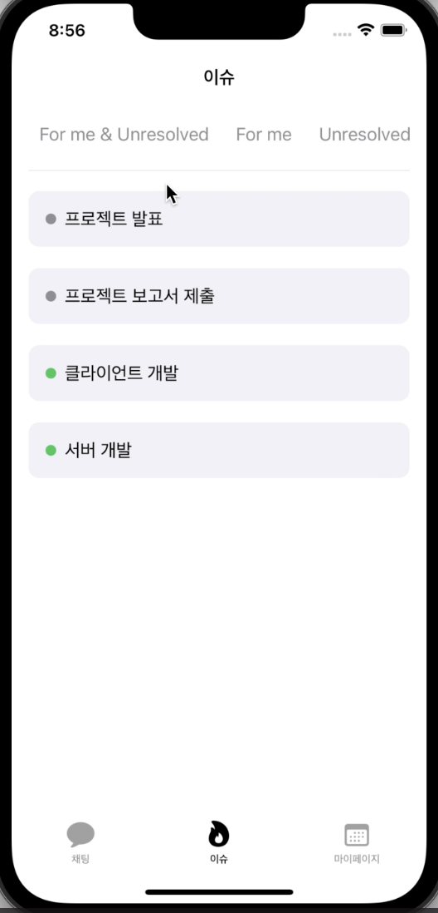 | 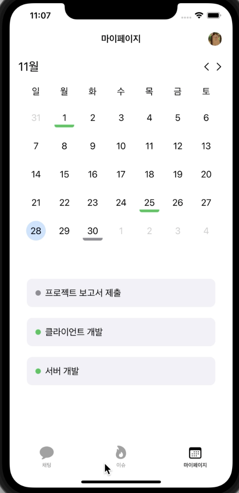 | 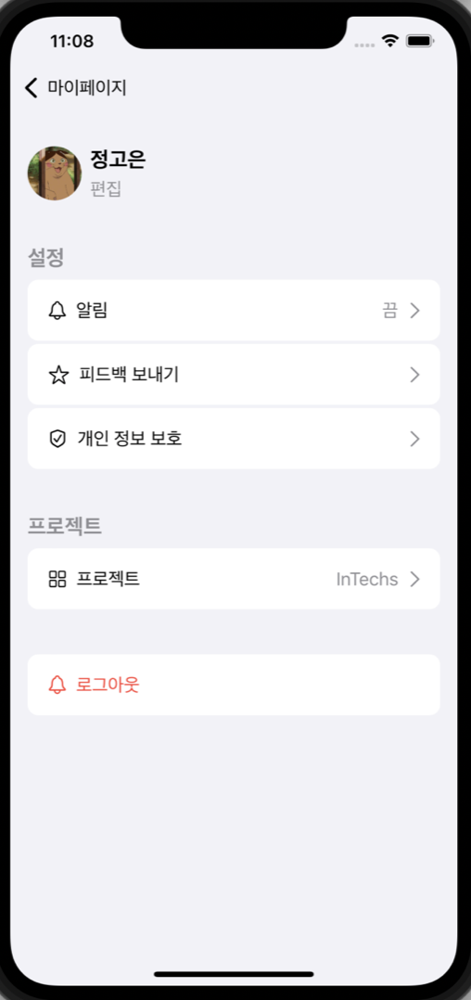 |


**watchOS**

|                        채팅                         |                       프로젝트 관리                       |
| :-------------------------------------------------: | :-------------------------------------------------------: |
| 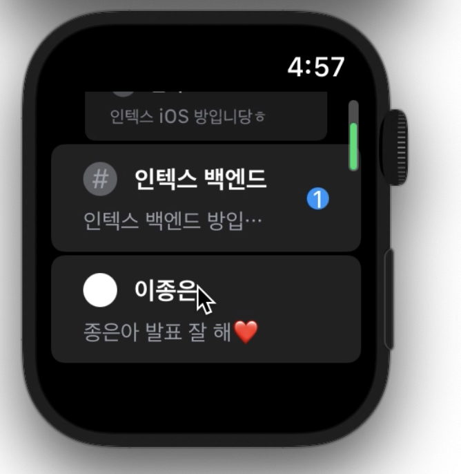 | 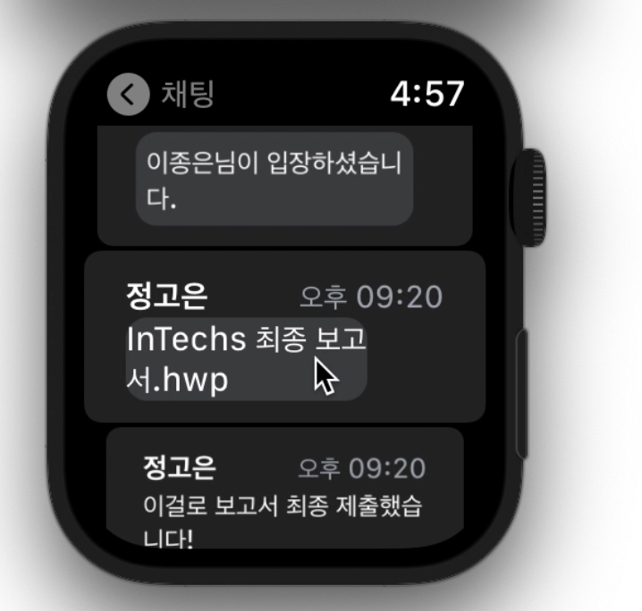 |


## Getting Started

```
$ git clone https://github.com/DSM-InTechs/InTechs-iOS
$ cd InTechs-iOS
$ pod install
```


## Requirements

- iOS 15+
- macOS 11+
- watchOS 6+
- CocoaPods


## Contribution

I'm waiting for your contribution.
